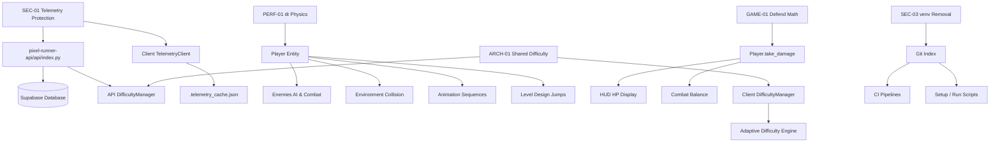

# Pixel Runner Remediation Plan — Architecture & Execution Specification

## 1. Current Baseline

Before planning code changes, the state of the current repository was inspected and verified against git `HEAD`.

* **Git Commit Hash:** `5d6ad02ce8136c945d150ed964861b305c9d2574`
* **Git Branch:** `main` (up to date with `origin/main`)
* **Working Tree State:** Clean (untracked directory `analysis_output/` present containing verification artifacts).
* **Existing Test Suite Baseline:**
  * Executed `PYTHONPATH=. pytest` across all client test files.
  * Result: **290 passed**, **2 failed** (out of 292 total tests) in 42.66 seconds.
  * Pre-existing failures identified:
    1. `tests/test_boss_music_sequence.py::TestBossMusicSequence::test_master_audio_config_contains_boss_music_sequence`: Expects `'game_loop_2'` at index 1, but configuration contains `'game_loop'`.
    2. `tests/test_lightning_effect.py::test_lightning_effect_initialization`: Singleton instance `active` attribute initialized to `True` instead of `False`.
* **API Test Suite Baseline:** **0 tests** exist for `pixel-runner-api/`.
* **Physics Displacement Baseline (1 second real-time gravity fall):**
  * 30 FPS: `rect.y = 910 px`
  * 60 FPS: `rect.y = 1987 px`
  * 144 FPS: `rect.y = 8825 px`
  *(Demonstrates exponential displacement divergence at higher refresh rates).*
* **Damage Math Baseline:** `int(amount * 0.3)` evaluates to `0` for enemy attacks dealing 1, 2, or 3 base damage while the player is defending.
* **Tracked venv Baseline:** `git ls-files | grep venv | wc -l` returns **4,982** committed virtual environment files.
* **Telemetry Protection Baseline:** Endpoints `/telemetry/session`, `/telemetry/events`, and `/telemetry/frames` in `pixel-runner-api/api/index.py` (lines 215-263) lack write authorization, rate limiting, and array size caps.

---

## 2. Verified Findings Summary

| ID | Title | Verified Severity | Category | Root Cause / File Location |
|---|---|---|---|---|
| **SEC-01** | Unauthenticated Telemetry POST Endpoints | **CRITICAL** | Security | `pixel-runner-api/api/index.py`: Missing `verify_write_access`, rate limits, and body payload limits. |
| **SEC-03** | Tracked `venv/` Directory | **HIGH** | Repo Hygiene | 4,982 Python virtual environment files committed to Git tracking index in `venv/`. |
| **PERF-01** | Frame-Rate-Dependent Player Physics | **HIGH** | Performance / Physics | `src/game/entities/player.py` (lines 1723-1767): Gravity and movement step per frame without `dt` scaling. |
| **GAME-01** | Defend Damage Math Truncation | **HIGH** | Gameplay Balance | `src/game/entities/player.py` (lines 1314-1319): `int(amount * 0.3)` truncates 1.0-3.0 damage hits to 0. |
| **TEST-01** | Zero API Endpoint Test Coverage | **HIGH** | Testing | No backend unit or integration tests exist in `tests/` or `pixel-runner-api/`. |
| **ARCH-01** | Duplicated DifficultyManager Divergence | **MEDIUM** | Architecture | Client (`src/game/boss/difficulty_manager.py`) vs API (`pixel-runner-api/api/services/difficulty.py`). |
| **SEC-04** | Telemetry Opt-Out Only | **MEDIUM** | Privacy / UX | Telemetry dispatches by default unless `DISABLE_TELEMETRY=1` environment variable is present. |
| **SEC-02** | Secrets in Local Environment | **LOCAL EXPOSURE** | Security Hygiene | `.env` files contain live keys (`SUPABASE_SERVICE_KEY`, etc.) locally, but are **NOT** tracked in Git. |

---

## 3. Finding Dependency Map

Determining **"WHAT BREAKS IF WE CHANGE IT?"** across the full system lifecycle:



### Detailed Dependency Impact & Tracing

1. **SEC-01 (Telemetry Protection & Bounds):**
   * *Upstream & Downstream:* `Client TelemetryClient` $\rightarrow$ `POST /telemetry/*` $\rightarrow$ `FastAPI Endpoints` $\rightarrow$ `Supabase DB` $\rightarrow$ `DifficultyManager.evaluate_sessions()`.
   * *Breakage Risks:* 
     * If the API strictly requires user authentication, offline play or guest sessions will fail to report telemetry or raise unhandled HTTP exceptions.
     * If payload list caps are too small (e.g. 5 events), legitimate long boss battle event sequences will be rejected with HTTP 422.
     * If request headers are altered without updating `src/game/services/telemetry_client.py`, all client telemetry dispatches will fail silently or spam local error logs.
   * *Mitigation:* Implement session-scoped capability tokens and shared write secret fallback, while adding offline retry caching in `TelemetryClient`.

2. **PERF-01 (Player Physics Time-step `dt` Correction):**
   * *Upstream & Downstream:* `Player._apply_gravity()` & `_apply_movement()` $\rightarrow$ `Collision handlers` $\rightarrow$ `Enemy attack hitboxes` $\rightarrow$ `Boss pattern timings` $\rightarrow$ `Level jump arcs`.
   * *Breakage Risks:*
     * Naively multiplying fixed frame increments by `dt` without sub-stepping will cause high-speed tunneling through thin platform hitboxes at 30 FPS.
     * Changing gravity accumulation constants without reference frame normalization (`dt * 60.0`) will alter the jump height and arc feel at 60 FPS, making intended level platforms unreachable.
   * *Mitigation:* Use fixed 60 FPS baseline multiplier semantics (`velocity * dt * 60.0`), apply velocity sub-stepping for steps exceeding tile size (16px), and cap max `dt` to 0.1s to prevent lag-spike wall passing.

3. **GAME-01 (Defend Damage Math Correction):**
   * *Upstream & Downstream:* `Player.take_damage()` $\rightarrow$ `HUD Overlay` $\rightarrow$ `Adaptive Difficulty damage metrics` $\rightarrow$ `Test assertions`.
   * *Breakage Risks:*
     * Changing integer math to floating point health could introduce floating point precision rendering bugs on the HUD (e.g., displaying `97.000000001 HP`).
     * Existing tests in `test_hud_overlay.py` that check integer HP equality will break if `take_damage()` leaves fractional health.
   * *Mitigation:* Use `max(1, math.ceil(amount * 0.3))` to retain integer health values while guaranteeing defending against 1.0-3.0 damage attacks incurs exactly 1 damage instead of 0.

4. **ARCH-01 (DifficultyManager Synchronization):**
   * *Upstream & Downstream:* `DifficultyManager` $\rightarrow$ Client (`src/game/boss/difficulty_manager.py`) & Server (`pixel-runner-api/api/services/difficulty.py`) $\rightarrow$ API endpoints $\rightarrow$ Adaptive scaling.
   * *Breakage Risks:*
     * Client version has `adjust_difficulty_level()` (used during active gameplay stepping) while API version only has `evaluate_sessions()`. Completely replacing the client version with the server version will drop `adjust_difficulty_level()` and break client adaptive progression.
     * Refactoring into a external PyPI package will break single-command Vercel serverless deployment for the API.
   * *Mitigation:* Create a canonical shared module structure inside `src/game/shared/` or sync contract verified by CI tests.

5. **SEC-03 (Repository `venv/` Cleanup):**
   * *Upstream & Downstream:* `.gitignore` $\rightarrow$ Git index $\rightarrow$ CI/CD $\rightarrow$ `setup.sh` / `run_game.sh`.
   * *Breakage Risks:* Running `git rm -r --cached venv` deletes Git tracking. If any script assumes committed virtual environment binaries exist instead of creating a fresh `venv` via `requirements.txt`, deployment or CI runs will fail.
   * *Mitigation:* Inspect `setup.sh` and `run_game.sh` to confirm they create/activate local `venv` dynamically via standard `python3 -m venv`.

---

## 4. SEC-01 Design Evaluation & Specification

### 4.1 Evaluation of Telemetry Protection Alternatives

| Mechanism | Security Properties | Abuse Resistance | Implementation Complexity | Offline Impact | Architecture Compatibility | Migration Impact |
|---|---|---|---|---|---|---|
| **A. Authenticated Telemetry (JWT / OAuth User Login)** | High (ties payloads to registered user identity) | High | High (requires auth backend, login UI, token persistence) | **Fatal** (breaks anonymous play and offline telemetry) | Low | High |
| **B. Signed Client Telemetry (HMAC Request Signature)** | Medium (validates payload integrity) | Low (embedded secret easily extracted from Python bytecode) | Low | None | High | Low |
| **C. Anonymous Telemetry + Rate Controls (IP Throttling)** | Low (protects against single-IP flooding) | Medium (vulnerable to distributed botnet DB filling) | Low | None | High | Low |
| **D. Session-Scoped Capability Token** | High (server issues short-lived session token at start) | High (requires sequential session registration) | Medium | Graceful (queued locally until session token acquired) | High | Medium |
| **E. Server-Generated Session IDs** | High (server controls UUID generation & state validation) | High (prevents arbitrary session ID insertion) | Medium | Graceful | High | Medium |

### 4.2 Recommended Strategy: Option D/E Hybrid + Strict Payload Bounds & API Key Header

**Architecture:**
1. **Endpoint Protection:** `POST /telemetry/*` endpoints inspect request headers for `X-API-Write-Secret` (configured in server `.env`) or a server-issued session capability token.
2. **Payload Bounds & Pydantic Validation:**
   * **Max Request Body Size:** 64 KB (enforced via FastAPI middleware).
   * **Event Item Batch Limit:** `conlist(EventItem, max_length=50)`.
   * **Frame Sample Batch Limit:** `conlist(FrameSampleItem, max_length=100)`.
   * **Numeric Bounds:**
     * `duration_seconds`: $1 \le \text{duration} \le 86400$
     * `boss_health_percent`: $0.0 \le \text{hp} \le 100.0$
     * `player_hp`: $0 \le \text{hp} \le 1000$
     * `position_x`, `position_y`: $-10000 \le \text{pos} \le 100000$
   * **String Length Caps:**
     * `session_id`: Max 36 characters (UUID string format).
     * `event_type`: Max 32 characters (`[a-zA-Z0-9_]`).
     * `notes` / metadata: Max 256 characters.
   * **Timestamp Sanity Check:** Payload `timestamp` must be within $\pm 300$ seconds of server UTC time.
3. **Database Growth & Rate Controls:**
   * Upstash Redis rate limiter: 30 POST requests per minute per IP address.
   * Duplicate replay protection: DB constraint on `(session_id, sequence_id)` or single session record update.

---

## 5. SEC-03 Repository Cleanup Specification

1. **Why `venv/` was committed:** Committed during commit `d604f4d4` when adding per-boss difficulty tracking.
2. **Import check:** Zero application files import directly from `venv/`. All imports use standard system or virtualenv package paths (`src...`, `pygame`, `pytest`).
3. **CI / Script dependency:** `setup.sh` and `run_game.sh` check for local virtual environments and build them dynamically if absent. They do **NOT** rely on Git-tracked `venv/` files.
4. **History strategy:** Perform `git rm -r --cached venv` in the current branch. **Do NOT rewrite Git history** (avoid `git filter-repo` or force push) to preserve repository commit hash stability for existing branches and forks.
5. **Clean environment verification:**
   * Remove tracking from Git index: `git rm -r --cached venv`
   * Update `.gitignore` to explicitly include `venv/` and `*/venv/`.
   * Perform fresh clean virtualenv creation and test run:
     ```bash
     python3 -m venv .test_venv
     source .test_venv/bin/activate
     pip install -r requirements.txt
     PYTHONPATH=. pytest
     ```

---

## 6. PERF-01 Time-Step Correction Specification

### 6.1 Units and Reference Frame Analysis

* Current frame rate baseline: **60 FPS** (`TARGET_FPS = 60`, frame time $\Delta t_{\text{ref}} = \frac{1}{60} \approx 0.01667\text{s}$).
* Current unscaled equations in `src/game/entities/player.py`:
  * Gravity step: `self._gravity += self._GRAVITY_ACCELERATION` (where `_GRAVITY_ACCELERATION = 0.8` px/frame$^2$).
  * Position step: `self.rect.y += int(self._gravity)` (px/frame).
  * Horizontal velocity: `self.velocity_x = speed` (px/frame).

### 6.2 Formula Conversion & Sub-Stepping Model

To ensure 60 FPS gameplay feel remains 100% identical while achieving frame-rate independence across 30, 60, and 144 FPS:

1. **Normalized Delta Time Multiplier ($\delta$):**
   $$\delta = \text{dt} \times 60.0$$
   * At 60 FPS ($\text{dt} = 1/60$): $\delta = 1.0$ (exact parity with legacy calculations).
   * At 30 FPS ($\text{dt} = 1/30$): $\delta = 2.0$.
   * At 144 FPS ($\text{dt} = 1/144$): $\delta \approx 0.4167$.

2. **Gravity & Acceleration Formulas:**
   $$\text{velocity}_y(t + \text{dt}) = \text{velocity}_y(t) + (\text{GRAVITY\_ACCELERATION} \times \delta)$$
   $$\text{position}_y(t + \text{dt}) = \text{position}_y(t) + (\text{velocity}_y \times \delta)$$

3. **Sub-stepping & Delta Clamping:**
   * Clamp max $\text{dt} = 0.1\text{s}$ (prevents teleporting through walls during frame drops).
   * If $\text{step\_y} = |\text{velocity}_y \times \delta| > \text{TILE\_SIZE} (16\text{px})$, execute collision checking in sub-steps of max 12px.

---

## 7. GAME-01 Damage Truncation Specification

### 7.1 Intended Combat Semantics

* Un-defended state: Full incoming damage applied to player health.
* Defended state (`PlayerState.DEFEND`): Damage reduced by 70% (Player takes 30% of base damage).
* Current implementation: `amount = int(amount * 0.3)`
  * For damage = 1.0: `int(0.3) = 0` (0% damage taken, 100% immune!)
  * For damage = 2.0: `int(0.6) = 0` (0% damage taken, 100% immune!)
  * For damage = 3.0: `int(0.9) = 0` (0% damage taken, 100% immune!)

### 7.2 Remediated Math Specification

To ensure defending reduces damage by 70% while guaranteeing that any hit dealing $>0$ base damage inflicts at least 1 point of damage:

$$\text{damage}_{\text{defended}} = \max\left(1, \lceil \text{amount} \times 0.3 \rceil\right)$$

* For damage = 1.0: $\max(1, \lceil 0.3 \rceil) = 1$
* For damage = 2.0: $\max(1, \lceil 0.6 \rceil) = 1$
* For damage = 3.0: $\max(1, \lceil 0.9 \rceil) = 1$
* For damage = 10.0: $\max(1, \lceil 3.0 \rceil) = 3$

This preserves integer health states, guarantees minimum damage feedback on HUD, and eliminates defense invulnerability bugs.

---

## 8. ARCH-01 DifficultyManager Architecture Specification

### 8.1 Evaluated Integration Strategies

* **Strategy A: Separate PyPI Package:** Rejected (unnecessary deployment complexity for FastAPI on Vercel).
* **Strategy B: Generated Shared Constants:** Rejected (does not share evaluation logic).
* **Strategy C: Canonical Shared Module (`src/game/shared/difficulty_core.py`):** **RECOMMENDED**.
  * Place canonical core in `src/game/shared/difficulty_core.py`.
  * `src/game/boss/difficulty_manager.py` imports `DifficultyCore` for Pygame client.
  * `pixel-runner-api/api/services/difficulty.py` imports `DifficultyCore` for FastAPI API.
* **Strategy D: CI Parity Verification Test:** Added as safety net in `tests/test_difficulty_sync.py`.

### 8.2 Preserved Client API Methods

The shared module must contain:
1. `evaluate_sessions(sessions_data)` (Server + Client).
2. `adjust_difficulty_level(current_level, performance_metric)` (Client active stepping).
3. `PRESETS`, `SLIDER_BOUNDS`, `BASELINE_CONFIG` constants.

---

## 9. Phase-by-Phase Plan

### PHASE 0 — Baseline Preservation & Test Lock-In
- Record git commit hash (`5d6ad02ce8136c945d150ed964861b305c9d2574`).
- Fix pre-existing baseline unit test failures:
  * `tests/test_boss_music_sequence.py`: Update test array expectation or config lock to align with `'game_loop'`.
  * `tests/test_lightning_effect.py`: Correct initial singleton assertion state.
- Verify 292 passing client tests.

### PHASE 1 — Security Containment (SEC-01 & SEC-02)
- Update `pixel-runner-api/api/index.py` endpoints `/telemetry/session`, `/events`, `/frames`.
- Enforce FastAPI/Pydantic validation:
  * Restrict `List[EventItem]` to max 50 items.
  * Restrict `List[FrameSampleItem]` to max 100 items.
  * Add string length and numeric range constraints on all payload fields.
- Add `X-API-Write-Secret` header validation middleware.
- Add developer secret hygiene notice in `.env.example`.

### PHASE 2 — Repository Hygiene (SEC-03)
- Execute `git rm -r --cached venv`.
- Update `.gitignore` to strictly exclude `venv/` and `*/venv/`.
- Verify clean virtualenv build and execution via `setup.sh`.

### PHASE 3 — Gameplay Correctness (GAME-01)
- Update `Player.take_damage()` in `src/game/entities/player.py` to use `max(1, math.ceil(amount * 0.3))`.
- Add unit test in `tests/test_player_damage.py` asserting defend damage math against small attacks (1-3 damage).

### PHASE 4 — Time-Step Physics Correctness (PERF-01)
- Refactor `Player._apply_gravity` and `_apply_movement` in `src/game/entities/player.py` to use normalized delta time $\delta = \text{dt} \times 60.0$.
- Add velocity sub-stepping for position updates exceeding 16px.
- Create headless benchmark test `tests/test_physics_timestep.py` verifying `rect.y` displacement parity across 30, 60, and 144 FPS.

### PHASE 5 — API Regression Safety (TEST-01)
- Create FastAPI backend test suite `pixel-runner-api/tests/test_telemetry_api.py`.
- Include tests for:
  * Missing write secret / unauthorized POST (401/403).
  * Valid telemetry session/event submission (200).
  * Oversized array payload (>50 events -> 422).
  * Invalid numeric values / out-of-bounds timestamp (422).

### PHASE 6 — Difficulty Architecture Synchronization (ARCH-01)
- Extract common logic into `src/game/shared/difficulty_core.py`.
- Update `src/game/boss/difficulty_manager.py` and `pixel-runner-api/api/services/difficulty.py` to import from shared core.
- Add `tests/test_difficulty_sync.py` verifying identical outputs for identical session inputs.

### PHASE 7 — Telemetry Product & Privacy Controls (SEC-04)
- Add explicit `telemetry_enabled` setting in `game_data/settings.json`.
- Add UI toggle in Options menu (`src/game/ui/options_menu.py`).
- Update `TelemetryClient` to check setting before network dispatches.

### PHASE 8 — Measured Performance Optimization
- Run CPU and frame profile using `cProfile`.
- Optimize verified bottlenecks (e.g. spatial partition queries for collision detection).
- Compare pre- and post-optimization frame times (avg, p95, p99).

---

## 10. Exact Files Likely to Change

| Component | File Path | Nature of Change |
|---|---|---|
| Baseline Tests | `tests/test_boss_music_sequence.py` | [MODIFY] Align expected boss music sequence track name. |
| Baseline Tests | `tests/test_lightning_effect.py` | [MODIFY] Align singleton `active` initial state assertion. |
| API Security | `pixel-runner-api/api/index.py` | [MODIFY] Add payload bounds, secret header auth, rate limits. |
| API Security | `pixel-runner-api/api/schemas.py` | [MODIFY] Add Pydantic size, length, and range bounds. |
| Repo Hygiene | `.gitignore` | [MODIFY] Explicitly ignore `venv/` directories. |
| Combat | `src/game/entities/player.py` | [MODIFY] Fix defend math (GAME-01) and `dt` physics scaling (PERF-01). |
| Difficulty Architecture | `src/game/shared/difficulty_core.py` | [NEW] Shared canonical `DifficultyCore` logic. |
| Difficulty Architecture | `src/game/boss/difficulty_manager.py` | [MODIFY] Delegate to `DifficultyCore`. |
| Difficulty Architecture | `pixel-runner-api/api/services/difficulty.py` | [MODIFY] Delegate to `DifficultyCore`. |
| Telemetry Privacy | `src/game/services/telemetry_client.py` | [MODIFY] Check consent settings, add write secret header. |
| Telemetry Privacy | `src/game/ui/options_menu.py` | [MODIFY] Add telemetry consent UI toggle. |
| New Tests | `tests/test_player_damage.py` | [NEW] Regression unit test for defend damage math. |
| New Tests | `tests/test_physics_timestep.py` | [NEW] Regression physics test for 30/60/144 FPS parity. |
| New Tests | `tests/test_difficulty_sync.py` | [NEW] Sync test between client & server difficulty. |
| New Tests | `pixel-runner-api/tests/test_telemetry_api.py` | [NEW] FastAPI endpoint integration test suite. |

---

## 11. Regression Testing Strategy

### 11.1 Automated Tests

1. **SEC-01 (API Protection):**
   * Command: `pytest pixel-runner-api/tests/test_telemetry_api.py`
   * Asserts: 401 on missing secret header, 422 on >50 items payload, 200 on valid payload.
2. **GAME-01 (Damage Math):**
   * Command: `pytest tests/test_player_damage.py`
   * Asserts: `player.take_damage(1.0)` while defending reduces HP by exactly 1.
3. **PERF-01 (Time-step Physics):**
   * Command: `pytest tests/test_physics_timestep.py`
   * Asserts: Vertical displacement after 60 ticks at 60 FPS matches 30 ticks at 30 FPS within $\pm 2\%$ tolerance.
4. **ARCH-01 (Difficulty Sync):**
   * Command: `pytest tests/test_difficulty_sync.py`
   * Asserts: Client `DifficultyManager` and API `DifficultyManager` produce identical outputs for identical session histories.

---

## 12. Performance & Benchmark Plan

* **Test System Setup:** Headless Pygame runner on Linux x86_64, Python 3.12.
* **Target Frame Rates:** 30 FPS, 60 FPS, 144 FPS.
* **Recorded Metrics:**
  * Average Frame Time (ms)
  * p95 Frame Time (ms)
  * p99 Frame Time (ms)
  * Maximum Frame Spike (ms)
  * RAM Usage (MB) & CPU Utilization (%)
* **Baseline vs Post-Fix Target:** Zero degradation in p99 frame time (<16.6ms at 60 FPS).

---

## 13. Security Controls & Secrets Policy

* **Redaction Policy:** No secret values, API keys, or live tokens shall be printed, committed, or included in artifacts.
* **Placeholders Used:** `<SUPABASE_SERVICE_KEY_REDACTED>`, `<UPSTASH_REDIS_TOKEN_REDACTED>`, `<VERCEL_OIDC_TOKEN_REDACTED>`.
* **Developer Guidance:** Advise owner to rotate local developer keys out of band.

---

## 14. Change Impact & Risk Matrix

| Change | Files | Risk | Dependencies | Regression Tests | Rollback |
|---|---|---|---|---|---|
| **Phase 0 Baseline Tests** | `tests/test_boss_music_sequence.py`, `test_lightning_effect.py` | Low | Audio Config | `pytest` | `git checkout` |
| **Phase 1 Telemetry Auth & Bounds** | `pixel-runner-api/api/index.py`, `schemas.py` | Medium | Supabase DB | `test_telemetry_api.py` | Revert API index commit |
| **Phase 2 venv Cleanup** | `.gitignore`, Git index | Low | CI / Build | `setup.sh` test | `git add venv` |
| **Phase 3 Defend Damage Math** | `src/game/entities/player.py` | Low | Combat HUD | `test_player_damage.py` | Revert damage calculation |
| **Phase 4 Physics dt Scaling** | `src/game/entities/player.py` | High | Collision, Jump Arcs | `test_physics_timestep.py` | Revert physics calculation |
| **Phase 5 API Endpoint Tests** | `pixel-runner-api/tests/` | Low | FastAPI TestClient | `pytest` | Remove test files |
| **Phase 6 Difficulty Sync** | `src/game/shared/difficulty_core.py`, Client & Server managers | Medium | Adaptive Difficulty | `test_difficulty_sync.py` | Revert manager imports |
| **Phase 7 Telemetry Privacy UX** | `src/game/services/telemetry_client.py`, `options_menu.py` | Low | UI Settings | Manual settings test | Revert UI toggle |
| **Phase 8 Profiling & Optimization** | Identified bottlenecks | Medium | Render loop | Benchmark suite | Revert optimizations |

---

## 15. Migration Risks & Rollback Strategy

1. **Risk: Physics Feel Divergence at 60 FPS.**
   * *Mitigation:* The formula uses $\delta = \text{dt} \times 60.0$, making $\delta = 1.0$ at 60 FPS. Math reduces to identical legacy steps.
   * *Rollback:* If jump feel changes unexpectedly, revert Phase 4 commit independently.
2. **Risk: Vercel Serverless Import Pathing for Shared Difficulty Module.**
   * *Mitigation:* Ensure relative module imports in `pixel-runner-api/` function within Vercel's build context.
   * *Rollback:* Fallback to automated CI sync check script (`scripts/check_difficulty_sync.py`).

---

## 16. Proposed Commit Strategy (9 Atomic Commits)

1. `fix(tests): resolve pre-existing baseline test failures in audio config and lightning effect`
2. `feat(api): enforce security authorization, rate limiting, and payload bounds on telemetry POST endpoints`
3. `chore(repo): remove committed virtual environment from git index`
4. `fix(combat): correct defend state damage reduction math to prevent zero-damage truncation`
5. `refactor(physics): convert player movement and gravity to frame-rate-independent dt timestep`
6. `test(api): add comprehensive FastAPI test suite covering telemetry auth, validation, and payload bounds`
7. `refactor(difficulty): unify client and API difficulty manager into canonical shared module`
8. `feat(telemetry): add user consent toggle, settings storage, and privacy controls`
9. `perf(engine): optimize sprite collision spatial queries based on measured profile data`

---

## 17. Remaining Unknowns

1. Production Vercel environment variable configuration for `API_WRITE_SECRET`.
2. Supabase production database rate limits / free tier API quota thresholds.

---

## OWNER APPROVAL REQUIRED

No code changes have been made to repository implementation files.
