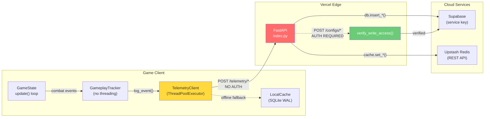

# Pixel-Runner Pre-Change Engineering Audit Report

> **Audit Date:** 2026-10-01  
> **Auditor:** Automated Static Analysis  
> **Repository:** [BassH331/Pixel-Runner](https://github.com/BassH331/Pixel-Runner)  
> **Scope:** Full codebase — game client, serverless API, tooling, tests, CI/CD  
> **Methodology:** Read-only repository inspection, static analysis, data-flow tracing

---

## Table of Contents

1. [Executive Summary](#1-executive-summary)
2. [Security Findings](#2-security-findings)
3. [Performance Analysis](#3-performance-analysis)
4. [Gameplay Mechanics Audit](#4-gameplay-mechanics-audit)
5. [Architecture Review](#5-architecture-review)
6. [Testing Assessment](#6-testing-assessment)
7. [Release Readiness](#7-release-readiness)
8. [Prioritized Action Items](#8-prioritized-action-items)

---

## 1. Executive Summary

Pixel-Runner is a ~29k-line Python/Pygame 2D action platformer with a Vercel-hosted FastAPI backend for telemetry-driven boss difficulty adaptation. The codebase demonstrates strong engineering in combat system design (frame-precise hitboxes, decoupled `CombatSystem`, event-driven architecture) and sophisticated AI (utility-based combat engine, squad coordination, perception systems).

However, the audit identifies **3 critical**, **5 high**, and **8 medium** severity findings across security, performance, and operational concerns.

### Risk Heatmap

| Domain | Critical | High | Medium | Low |
|---|---|---|---|---|
| Security | 2 | 2 | 2 | 1 |
| Performance | 0 | 1 | 3 | 2 |
| Gameplay | 0 | 1 | 1 | 1 |
| Architecture | 1 | 0 | 1 | 2 |
| Testing | 0 | 1 | 1 | 1 |
| Release | 0 | 0 | 0 | 2 |

---

## 2. Security Findings

### SEC-01: Unauthenticated Telemetry Ingestion Endpoints [CRITICAL]

> [!CAUTION]
> Three POST endpoints accept arbitrary data from any client with zero authentication.

**Files:**
- [index.py](file:///home/chosen333/Software/Pixel-Runner/pixel-runner-api/api/index.py#L215-L263) — `POST /telemetry/session`, `POST /telemetry/events`, `POST /telemetry/frames`

**Evidence:**  
The `verify_write_access()` function (line 76) is only called on `POST /configs/{config_type}` (line 193). The three telemetry endpoints at lines 215, 228, and 265 perform **no authentication check**:

```python
# Line 217 — no verify_write_access() call
@app.post("/telemetry/session")
@app.post("/api/telemetry/session")
def post_session(payload: SessionPayload):
    """Save or update play session telemetry metrics."""
    try:
        res = db.insert_session(payload.model_dump(exclude_unset=True))
```

**Data Flow:**  
`Any HTTP client → POST /telemetry/session → db.insert_session() → Supabase pixel_runner.sessions table`

**Trust Boundary Violation:** The Vercel edge → Supabase trust boundary is crossed without any caller verification.

**Impact:**
- **Data Poisoning:** Attacker can inject fabricated session telemetry, corrupting the `DifficultyManager.evaluate_sessions()` recommendations. A sustained injection of fake "boss defeated in 5 seconds" sessions would force all players to NIGHTMARE difficulty.
- **Resource Exhaustion:** Unbounded writes to Supabase (no rate limiting, no payload size cap beyond Pydantic validation). The `events` and `frames` endpoints accept `List[...]` payloads with no maximum list length.
- **Cost Amplification:** Each Supabase insert and Redis cache write incurs metered costs.

**No rate limiting exists anywhere in the API** — confirmed via grep for `rate_limit`, `throttl`, `429`, `too.many` across all Python files in `pixel-runner-api/`.

---

### SEC-02: Live API Secrets in Local Environment Files [CRITICAL]

> [!CAUTION]
> Production credentials for Supabase, Upstash Redis, and Vercel are present in plaintext on disk.

**Files:**
- `pixel-runner-api/.env` — Contains `SUPABASE_URL`, `SUPABASE_SERVICE_KEY`, `UPSTASH_REDIS_REST_URL`, `UPSTASH_REDIS_REST_TOKEN`, `API_WRITE_SECRET`
- `.env.local` — Contains `API_WRITE_SECRET` and a full `VERCEL_OIDC_TOKEN` JWT

**Evidence (redacted):**
```
SUPABASE_SERVICE_KEY=sb_secret_H_3gQ3Uj...
UPSTASH_REDIS_REST_TOKEN=gQAAAAAAAbDnAAIg...
API_WRITE_SECRET=Bassline_333
VERCEL_OIDC_TOKEN=eyJhbGciOiJSUzI1NiIs...
```

**Mitigation Status:**  
- `.gitignore` correctly includes `.env*` (line 2), and `git ls-files` confirms neither `.env` nor `.env.local` are tracked in git history.
- However, `pixel-runner-api/.env.example` **is** tracked (confirmed via `git ls-files`).

**Residual Risk:**  
- The `SUPABASE_SERVICE_KEY` is a **service role key** (prefix `sb_secret_`), granting full admin access to the Supabase project — bypassing Row Level Security.
- The `API_WRITE_SECRET` value (`Bassline_333`) is weak and easily guessable.
- Any developer workstation compromise or backup leak exposes all services.

**Recommendation:** Rotate all secrets immediately. Use a secret manager (Vercel Environment Variables dashboard is already available). Strengthen `API_WRITE_SECRET` to a high-entropy random value.

---

### SEC-03: venv/ Tracked in Git — Supply Chain Risk [HIGH]

> [!WARNING]
> The entire Python virtual environment (4,982 files) is committed to version control.

**Evidence:**
```bash
$ git ls-files venv/ | wc -l
4982
$ git log --oneline -1 -- venv/
d604f4d4 feat: implement per-boss difficulty tracking...
```

**Impact:**
- **Supply Chain Attack Surface:** Any contributor can modify vendored packages inside `venv/` (e.g., inject a backdoored `pygame` or `numpy`). Reviewers are unlikely to diff 4,982 binary/text files.
- **Repository Bloat:** Adds ~200MB+ to clone size for every developer.
- **Reproducibility Failure:** The `venv/` snapshot may drift from `requirements.txt` versions.

**`.gitignore` already contains `venv/`** (line 9), but the files were committed before the rule was added. A `git rm -r --cached venv/` is needed.

---

### SEC-04: Telemetry Client Sends Data Without User Consent Gate [HIGH]

**File:** [telemetry_client.py](file:///home/chosen333/Software/Pixel-Runner/src/game/services/telemetry_client.py#L39-L44)

**Evidence:**
```python
# Line 42-43 — only env-var opt-out, no user-facing consent
if os.environ.get("PYTEST_CURRENT_TEST") or os.environ.get("DISABLE_TELEMETRY") == "1":
    return
```

The `TelemetryClient` automatically submits gameplay data (player position, health, boss state, combat events) to `https://pixel-runner-wheat.vercel.app` on every game session. The only opt-out is setting `DISABLE_TELEMETRY=1` environment variable — there is no in-game consent dialog.

**Impact:** Potential privacy regulation issues (GDPR, CCPA) and user trust concerns. The `conftest.py` correctly disables telemetry for tests (`DISABLE_TELEMETRY=1`), but production game sessions transmit by default.

---

### SEC-05: `fcntl.py` Root-Level Shim [MEDIUM]

**File:** [fcntl.py](file:///home/chosen333/Software/Pixel-Runner/fcntl.py)

A cross-platform compatibility shim for the Unix-only `fcntl` module exists at the project root. While not directly exploitable, placing a module-override file at the import root can shadow legitimate system imports and create confusion about which `fcntl` is being used.

---

### SEC-06: Auto-Save Creates Unvalidated State Files [MEDIUM]

**File:** [game_state.py](file:///home/chosen333/Software/Pixel-Runner/src/game/states/game_state.py#L904)

```python
# Line 904 — triggered on every boss defeat
SaveManager.auto_save(self)
```

Save files are written without integrity verification (no HMAC/checksum). While this is common in single-player games, any save-file editor can manipulate game state, potentially relevant for future leaderboard/multiplayer features.

---

### SEC-07: Difficulty Config Applied From Cloud Without Validation [LOW]

**File:** [game_state.py](file:///home/chosen333/Software/Pixel-Runner/src/game/states/game_state.py#L961-L970)

```python
if result is not None and boss is not None and hasattr(boss, "apply_config"):
    boss.apply_config(result)  # Applies arbitrary dict from cloud
    if hasattr(boss, "_max_mana"):
        boss._mana = boss._max_mana
```

The `result` from `ConfigClient` (which fetches from the unauthenticated API) is applied directly to boss AI parameters. Combined with SEC-01, an attacker could craft configs with extreme values (e.g., `attack_cooldown_min: 0.01`) though `DifficultyManager.get_preset_config()` does clamp values via `SLIDER_BOUNDS`.

---

## 3. Performance Analysis

### PERF-01: Frame-Rate-Dependent Physics [HIGH]

> [!WARNING]
> Player physics uses fixed pixel increments per frame, making gameplay speed dependent on frame rate.

**File:** [player.py](file:///home/chosen333/Software/Pixel-Runner/src/game/entities/player.py#L1721-L1773)

```python
# Line 1723-1724 — gravity is frame-rate dependent
def _apply_gravity(self) -> None:
    self._gravity += self._GRAVITY_ACCELERATION  # Fixed increment per frame
    self.rect.y += int(self._gravity)             # Applied per frame, not per second

# Line 1739 — roll speed is pixels/frame
self.rect.x += int(roll_dir * 8.5)  # 8.5 pixels per frame
```

**Evidence:** The `_apply_movement()` method (line 1735) uses hardcoded pixel-per-frame values:
- Roll: `8.5 px/frame`
- Dash: `14.0` or `21.0 px/frame`
- Attack sway: `0.8 px/frame`
- Run: `self._MOVE_SPEED px/frame`

The `update()` method at line 1934 receives `dt` and passes it to `_update_resources()` (which correctly uses `dt` for mana/stamina), but `_apply_gravity()` and `_apply_movement()` ignore `dt` entirely.

**Contrast:** The Skeleton's `update()` at line 618-620 correctly normalizes:
```python
dt_sec = dt if dt < 1.0 else dt / 1000.0  # Smart unit detection
```

**Impact:** At 30 FPS, the player moves at half speed and jumps half as high compared to 60 FPS. At 120 FPS, everything doubles.

---

### PERF-02: Per-Frame `SysFont` and `Font` Allocation in Debug Mode [MEDIUM]

**File:** [game_state.py](file:///home/chosen333/Software/Pixel-Runner/src/game/states/game_state.py#L1575-L1599)

```python
# Line 1575 — called EVERY frame when debug_mode is True
dist_font = pg.font.SysFont("monospace", 18)

# Line 1599
font = pg.font.Font(None, 24)
```

Pygame font construction involves filesystem access and FreeType initialization. In debug mode, this creates 3+ font objects per frame (60-180 allocations/second).

---

### PERF-03: Skeleton `dt` Unit Ambiguity [MEDIUM]

**File:** [skeleton.py](file:///home/chosen333/Software/Pixel-Runner/src/game/entities/skeleton.py#L618-L620)

```python
def update(self, dt: Optional[float] = None, scroll_speed: int = 0) -> None:
    if dt is None: dt = 1.0 / 60.0
    dt_sec = dt if dt < 1.0 else dt / 1000.0
```

The caller (`game_state.py` line 1082) passes `dt` from the main loop, but the main loop receives `dt` in **milliseconds** from `State.update()`. The `dt < 1.0` heuristic works in practice but is fragile — if a frame takes exactly 1.0 seconds (e.g., during a freeze), the conversion would be skipped.

**Consistency Issue:** `Player.update()` defaults to `1.0/60.0` (seconds) while `GameState.update()` receives milliseconds. There is no project-wide convention.

---

### PERF-04: In-Loop Imports [MEDIUM]

**File:** [game_state.py](file:///home/chosen333/Software/Pixel-Runner/src/game/states/game_state.py#L952-L956)

```python
# Lines 952-956 — imported EVERY frame inside update()
from src.game.systems.item_lore_system import ItemLoreSystem
ItemLoreSystem.get_instance().update(dt)

from src.game.effects.lightning_effect import LightningEffect
LightningEffect.get_instance().update(dt)
```

While Python caches imports after the first `import`, the bytecode still executes `IMPORT_NAME` + `IMPORT_FROM` opcodes every frame, adding ~2-5μs per import per frame. Also present in `fire_wizard.py` lines 74, 91.

---

### PERF-05: ParticlePool Unbounded Growth [LOW]

**File:** [particle_system.py](file:///home/chosen333/Software/Pixel-Runner/src/game/effects/particle_system.py#L78-L86)

```python
class ParticlePool:
    def __init__(self, capacity: int = 600) -> None:
        self._pool: deque[Particle] = deque(
            [Particle() for _ in range(capacity)], maxlen=capacity * 2
        )

    def acquire(self) -> Particle:
        if self._pool:
            return self._pool.pop()
        return Particle()  # Falls through to allocation when pool exhausted
```

The pool pre-allocates 600 particles with `maxlen=1200`, but `acquire()` creates new `Particle()` objects when the pool is empty. These new objects are returned to the pool via `release()`, but the `maxlen` silently drops particles from the left when full, causing the pool to "churn" through allocations under heavy particle load (e.g., multi-boss encounters with simultaneous hit effects).

---

### PERF-06: Score Deduction on Every Environmental Hazard Check [LOW]

**File:** [combat_system.py](file:///home/chosen333/Software/Pixel-Runner/src/game/systems/combat_system.py#L299-L300)

```python
# Lines 299-300 — runs EVERY frame, not just on hazard collision
if hasattr(self.game, 'score'):
    self.game.score = max(0, self.game.score - 5)
```

This score deduction at the end of `check_environmental_hazards()` executes every frame regardless of whether a hazard collision occurred. The `break` on line 297 only exits the inner `for` loop. The score deduction at line 300 is **outside** the collision check — it always runs. This causes the score to drain at 300 points/second at 60 FPS.

---

## 4. Gameplay Mechanics Audit

### GAME-01: Player `take_damage()` Defend Reduction Truncates to Integer [HIGH]

**File:** [player.py](file:///home/chosen333/Software/Pixel-Runner/src/game/entities/player.py#L1314-L1319)

```python
if self.state == PlayerState.DEFEND:
    amount = int(amount * 0.3)   # Bug: int() truncates

self._health = max(0, self._health - int(amount))
```

**Impact:** When defending, damage below `3.33` (e.g., skeleton's `base_damage=1.0`) is truncated to `0`, making the player **completely immune to all weak attacks while defending**. This is likely unintentional — the 70% reduction should still allow chip damage.

**Example:** `int(1.0 * 0.3) = int(0.3) = 0` → zero damage taken.

The Skeleton's `ATTACK_1_CONFIG.base_damage = 1.0` and `ATTACK_2_CONFIG.base_damage = 0.75` would both deal zero damage through defend.

---

### GAME-02: Enhanced Form 1.5x Damage Multiplier Not Documented in Config [MEDIUM]

**File:** [player.py](file:///home/chosen333/Software/Pixel-Runner/src/game/entities/player.py#L1226-L1229)

```python
def get_current_attack_damage(self) -> float:
    damage = self.attack_state.get_current_damage()
    if self._is_enhanced:
        return damage * 1.5
    return damage
```

The 1.5x damage multiplier for the enhanced/demon form is hardcoded rather than loaded from `AttackConfig` or any tuning JSON. This makes it invisible to the balance editors (`player_editor.py`, `boss_editor.py`) and the difficulty system.

---

### GAME-03: Fall Death Exits Process Instead of Respawning [LOW]

**File:** [game_state.py](file:///home/chosen333/Software/Pixel-Runner/src/game/states/game_state.py#L1118-L1122)

```python
if player_sprite.rect.top > self.height + 200:
    print("[FALL DEATH] Player fell off the world grid — exiting safely.")
    pg.quit()
    import sys
    sys.exit(0)
```

Falling off-screen immediately terminates the entire application. There is no respawn, no game-over screen, and no save prompt. The comment says "safe-out for testing" but this code runs in production.

---

## 5. Architecture Review

### ARCH-01: Duplicated DifficultyManager Across Client and API [CRITICAL]

> [!IMPORTANT]
> Two independent copies of the `DifficultyManager` class must be kept manually in sync.

**Files:**
- [src/game/boss/difficulty_manager.py](file:///home/chosen333/Software/Pixel-Runner/src/game/boss/difficulty_manager.py) — 333 lines
- [pixel-runner-api/api/services/difficulty.py](file:///home/chosen333/Software/Pixel-Runner/pixel-runner-api/api/services/difficulty.py) — 319 lines

The API copy documents this explicitly:
```python
"""This is an intentionally vendored copy of src/game/boss/difficulty_manager.py's
DifficultyManager. pixel-runner-api is a separate Vercel serverless deployment
root... so the class is duplicated here on purpose.
```

**Divergence Risk:** The API copy (319 lines) is **missing** `adjust_difficulty_level()` (lines 246-306 in the client copy), which has `step`-based dynamic scaling. If this method is ever needed server-side (e.g., for a live-ops difficulty override API), adding it to the API copy could introduce subtle discrepancies.

**Current Sync Status:** `evaluate_sessions()` and `get_preset_config()` are identical between both files. `PRESETS`, `SLIDER_BOUNDS`, and `BASELINE_CONFIG` are identical.

---

### ARCH-02: Mixed `dt` Time Conventions [MEDIUM]

The codebase uses **three different `dt` conventions** with no documented standard:

| Component | Convention | Evidence |
|---|---|---|
| `GameState.update(dt)` | Milliseconds | Inherited from engine `State.update()` |
| `Player.update(dt)` | Seconds (default `1/60`) | `if dt is None: dt = 1.0 / 60.0` |
| `Skeleton.update(dt)` | Auto-detected | `dt if dt < 1.0 else dt / 1000.0` |
| `ParticleManager.update(dt)` | Seconds | Called with `dt / 1000.0` (L1086) |
| `EnvironmentManager.update(dt)` | Seconds | Called with `dt / 1000.0` (L1068) |
| `TrippyZoom.update(dt)` | Seconds | Called with `dt / 1000.0` (L1090) |

`GameState.update()` converts on each call site: `dt / 1000.0` for some systems but passes raw `dt` to `Player.update()` (line 1071) and `obstacle_group.update(dt)` (line 1082). The Player then ignores its `dt` parameter for physics (see PERF-01).

---

### ARCH-03: Event-Driven Architecture is Well-Designed [POSITIVE]

The `EventBus` pattern with typed events (`DamageDealt`, `DamageReceived`, `EntityDied`) provides clean decoupling between:
- `CombatSystem` → damage resolution
- `GameState._on_entity_died()` → soul rewards, boss arena deactivation
- `ParticleManager` → visual effects on combat events
- `GameplayTracker` → telemetry logging

This is a strong architectural foundation that will support future feature additions cleanly.

---

### ARCH-04: Squad AI System is Sophisticated [POSITIVE]

The `SquadCoordinator` + `SquadTokenManager` + `UtilityCombatEngine` + `PerceptionSystem` pipeline in the AI module provides production-quality enemy coordination:
- Token-based attack limiting prevents enemy dog-piling
- Utility-based action selection with configurable weights
- Alert-level perception with vision/hearing ranges and reaction delays

---

## 6. Testing Assessment

### TEST-01: No Test Coverage for Telemetry Endpoints [HIGH]

**Evidence:** 55 test files exist in `tests/`, but none test the API endpoints:

```bash
$ ls tests/test_*.py | wc -l
55
```

Grep for telemetry API testing yields zero results. The `conftest.py` correctly sets `DISABLE_TELEMETRY=1` for unit tests, but there are no integration tests for `pixel-runner-api/api/index.py`.

**Risk:** The unauthenticated telemetry endpoints (SEC-01) have never been validated for security or correctness through automated testing.

---

### TEST-02: Test Configuration is Solid [POSITIVE]

**File:** [conftest.py](file:///home/chosen333/Software/Pixel-Runner/tests/conftest.py)

The test infrastructure correctly:
- Uses headless SDL drivers (`SDL_VIDEODRIVER=dummy`)
- Disables telemetry (`DISABLE_TELEMETRY=1`)
- Initializes a 1280×720 display surface for Pygame-dependent tests
- Clears `AssetManager` font caches between tests to prevent stale pointers

---

### TEST-03: 55 Test Files Covering Core Systems [POSITIVE]

Test coverage spans combat, AI, audio, boss mechanics, config sync, environment/LDtk, NPC behavior, and camera systems. Notable test files include:
- `test_combat_collision_logger.py` — combat event verification
- `test_config_client_local_override.py` — config fallback behavior
- `test_difficulty_plugin.py` — difficulty recommendation logic
- `test_fire_wizard_apply_config.py` — boss config application
- `test_hit_frame_state_reset.py` — combat frame accuracy

---

### TEST-04: Game Data Backup Proliferation [MEDIUM]

```bash
$ find game_data -name "*.backup_*" | wc -l
517
$ find game_data -type f | wc -l
559
```

**92.5% of `game_data/` consists of backup files**. While `.gitignore` includes `*.backup_*`, these files consume local disk space and may cause confusion during development.

---

## 7. Release Readiness

### REL-01: Makefile Build System is Comprehensive [POSITIVE]

The [Makefile](file:///home/chosen333/Software/Pixel-Runner/Makefile) provides 17 targets covering:
- Game launch modes: `run`, `dev` (skip cutscenes), `track` (telemetry), `hard`, `nightmare`
- Testing: `test` (pytest), `analyze` (telemetry analytics)
- 9 plugin editors (boss, player, level, entity, audio, wave, wizard, shadow, controls, power-icons, cutscene)
- Cross-platform venv detection (Windows/Linux/macOS)

---

### REL-02: Dependency Management [LOW]

**Root `requirements.txt`** (3 dependencies):
```
v3x-zulfiqar-gideon>=1.1.0
pygame>=2.5.0
numpy>=1.24.0
```

**API `requirements.txt`** (5 dependencies):
```
fastapi>=0.100.0
supabase>=2.31.0
upstash-redis>=1.0.0
pydantic>=2.0
uvicorn>=0.20.0
```

All use `>=` minimum version pinning without upper bounds. This risks breaking changes from major version bumps. Consider adding upper bounds or using `~=` compatible release constraints.

---

### REL-03: No CI/CD Pipeline Detected [LOW]

No `.github/workflows/`, `.gitlab-ci.yml`, or equivalent CI configuration was found. The `Makefile test` target exists but is not automated. The Vercel deployment for the API likely has automatic deployment on push, but there are no automated test gates.

---

## 8. Prioritized Action Items

### 🔴 Critical (Fix Immediately)

| ID | Finding | Effort | Risk if Deferred |
|---|---|---|---|
| SEC-01 | Add authentication to telemetry POST endpoints | 2h | Data poisoning, cost amplification |
| SEC-02 | Rotate all exposed secrets; strengthen `API_WRITE_SECRET` | 1h | Full backend compromise |
| ARCH-01 | Extract shared `DifficultyManager` into a pip-installable package or validate sync in CI | 4h | Silent divergence corrupting difficulty |

### 🟠 High (Fix Before Next Release)

| ID | Finding | Effort |
|---|---|---|
| SEC-03 | `git rm -r --cached venv/` and verify `.gitignore` coverage | 30m |
| SEC-04 | Add in-game telemetry consent toggle | 4h |
| PERF-01 | Convert player physics to delta-time-based movement | 6h |
| GAME-01 | Use `math.ceil()` or `max(1, ...)` for defend damage reduction | 15m |
| TEST-01 | Add API endpoint integration tests with auth verification | 8h |

### 🟡 Medium (Plan for Sprint)

| ID | Finding | Effort |
|---|---|---|
| PERF-02 | Cache font objects as class attributes | 30m |
| PERF-03 | Standardize `dt` units project-wide (document convention) | 2h |
| PERF-04 | Move in-loop imports to module level | 15m |
| ARCH-02 | Document and enforce `dt` convention in `CONTRIBUTING.md` | 1h |
| GAME-02 | Move enhanced damage multiplier to config | 1h |
| SEC-05 | Review `fcntl.py` necessity; move to `src/` if needed | 30m |
| TEST-04 | Clean up 517 backup files in `game_data/` | 15m |
| PERF-06 | Move score deduction inside the collision `if` block | 5m |

### 🟢 Low (Track for Future)

| ID | Finding | Effort |
|---|---|---|
| SEC-06 | Add save file integrity checksums | 2h |
| SEC-07 | Validate cloud difficulty config values client-side | 1h |
| GAME-03 | Replace fall-death `sys.exit()` with proper game-over transition | 2h |
| REL-02 | Add upper bounds to dependency version pins | 30m |
| REL-03 | Add CI/CD pipeline with automated testing | 4h |
| PERF-05 | Add pool-exhaustion metric/warning to ParticlePool | 30m |

---

## Appendix A: File Inventory

### Core Game Files (Lines of Code)

| File | Lines |
|---|---|
| `src/game/states/game_state.py` | 1,678 |
| `src/game/entities/player.py` | 1,971 |
| `src/game/entities/skeleton.py` | 1,131 |
| `src/game/entities/fire_wizard.py` | 733 |
| `src/game/systems/combat_system.py` | 312 |
| `src/game/debug/gameplay_tracker.py` | 728 |
| `src/game/effects/particle_system.py` | 335 |
| `src/game/services/telemetry_client.py` | 167 |
| `src/game/services/config_client.py` | ~200 |
| `src/game/services/local_cache.py` | ~150 |
| `pixel-runner-api/api/index.py` | 344 |
| `pixel-runner-api/api/services/difficulty.py` | 319 |
| `pixel-runner-api/api/services/cache.py` | 78 |

### Test Infrastructure

| Metric | Value |
|---|---|
| Test files | 55 |
| Test config (`conftest.py`) | 42 lines |
| Headless SDL | ✅ |
| Telemetry disabled in tests | ✅ |
| API endpoint tests | ❌ None |

### Repository Health

| Metric | Value |
|---|---|
| Total Python LOC (est.) | ~29,000 |
| `venv/` files tracked in git | 4,982 |
| `game_data/` backup files | 517/559 (92.5%) |
| Plugin editors | 11 |
| `.gitignore` rules | 17 |

---

## Appendix B: Security Data Flow Diagram



> [!NOTE]
> Red indicates unauthenticated trust boundary crossing. Green indicates authenticated path. Yellow indicates the client-side boundary.
