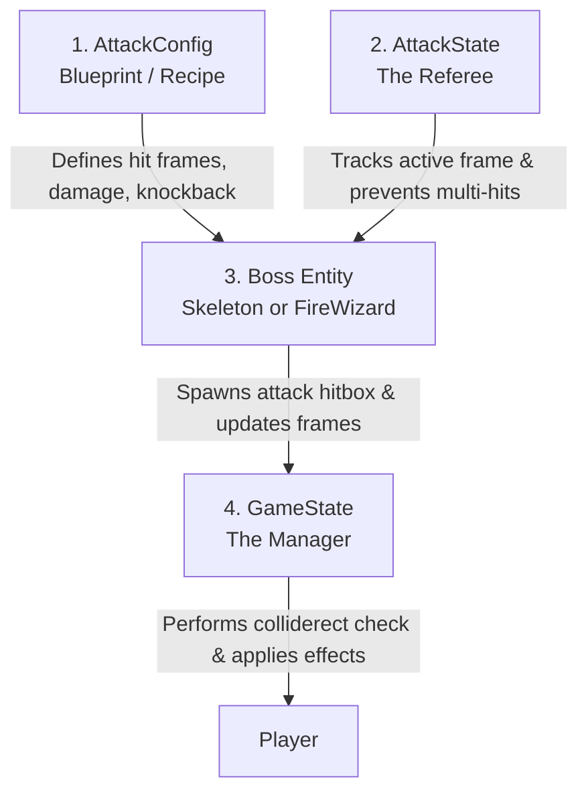

# Boss Attack and Collision System Guide

This guide explains how boss attacks, animation frames, AI behavior, and collision detection are structured and linked together across the game codebase.

---

## 🗺️ System Architecture Overview

The combat system is **frame-precise and state-driven**. Instead of basic collision detection that damages you whenever you touch a boss, damage only occurs during **specific frames of the attack animation** where the weapon or spell blast is active.

Here are the key components that work together:



---

## 🧩 The Core Entities

Depending on the spawn event parameter `sprite_dir` in the level configuration (e.g. `level_1.json`):
1. **`FireWizard`**: Spawns if `sprite_dir` contains `"wizard"`. This is the dedicated Fire Wizard boss entity.
2. **`Skeleton`**: Spawns otherwise, functioning as a fallback or standard skeletal enemy scaled to boss size.

### 1. `AttackConfig` (The Recipe Card)
* **Code location:** [combat.py (v3x_zulfiqar_gideon)](file:///home/chosen333/Software/V3X-Zulfiqar-Gideon/v3x_zulfiqar_gideon/combat.py#L44-L57)
* **What it is:** Defines the timing and physical properties for a single attack:
  - `hit_frames`: A set of animation frame indices where the attack is active and can deal damage.
  - `base_damage`: The damage value of the attack.
  - `knockback_force`: The knockback force applied to the player.

### 2. `AttackState` (The Referee's Notepad)
* **Code location:** [combat.py (v3x_zulfiqar_gideon)](file:///home/chosen333/Software/V3X-Zulfiqar-Gideon/v3x_zulfiqar_gideon/combat.py#L65-L169)
* **What it is:** Tracks the active attack, the current animation frame, and registers who has been hit to prevent multi-hit exploits on the player.

---

## 🔄 Step-by-Step Flow of an Attack

1. **AI Decision**: If the player is within horizontal range (`_attack_range`), the boss shifts its state to `ATTACK` and initiates its animation.
2. **Syncing State**: The base `Actor` class registers the change in state and triggers the referee: `self.attack_state.begin(self.current_attack_config)`.
3. **Running Check**: Every frame, the game manager `GameState` checks if:
   - The boss is in its attack state.
   - The current frame is in the `hit_frames` set.
   - The boss's projected attack hitbox (`get_attack_hitbox()`) overlaps with the player's hitbox (`player.rect`).
4. **Applying Damage & Knockback**: If all check gates pass, the boss registers the hit to prevent hitting the player again on subsequent frames of the same swing. The player takes damage and is pushed back by knockback force.
5. **Recovery & Chase Cooldown**: When the attack ends, the boss transitions to `IDLE` and initiates a **chase cooldown** (e.g., 1.8 seconds). During this cooldown, the boss stays idle, giving the player breathing room and space to run.

---

## 🛠️ How to Customize Boss Combat

You can modify several distinct areas to customize how the boss behaves, attacks, and collides.

### A. Adjusting Boss Scaling (HP, Speed, and Scale)

#### For the Fire Wizard Boss:
In [fire_wizard.py:L70-90](file:///home/chosen333/Software/Pixel-Runner/src/game/entities/fire_wizard.py#L70-L90):
```python
if self.tier == "boss":
    self._max_health = 150.0      # Boss max HP
    self._speed = 3.0             # Boss movement speed
    damage_scale = 3.0            # Multiplier for spell damage
    knockback_scale = 1.5         # Multiplier for knockback force
```

#### For the Skeleton Boss:
In [skeleton.py:L170-190](file:///home/chosen333/Software/Pixel-Runner/src/game/entities/skeleton.py#L170-L190):
```python
if self.tier == "boss":
    if not sprite_root:
        self.scale *= 1.8
    self._max_health = 150.0
    self._speed = 3.2
    damage_scale = 3.0
    knockback_scale = 1.8
```

---

### B. Modifying Attack Properties (Hit Frames, Damage, & Knockback)

#### For the Fire Wizard Boss:
In [fire_wizard.py:L35-43](file:///home/chosen333/Software/Pixel-Runner/src/game/entities/fire_wizard.py#L35-L43):
```python
# Active hit frames are frames 4 and 5 of the 8-frame casting animation
ATTACK_CONFIG: Final[AttackConfig] = AttackConfig(
    hit_frames=frozenset({4, 5}),   # Modify these indices to adjust visual sync
    base_damage=2.5,
    knockback_force=7.0,
)
```

#### For the Skeleton Boss:
In [skeleton.py:L47-58](file:///home/chosen333/Software/Pixel-Runner/src/game/entities/skeleton.py#L47-L58):
```python
ATTACK_1_CONFIG: Final[AttackConfig] = AttackConfig(
    hit_frames=frozenset({6}),
    base_damage=1.0,
    knockback_force=8.0,
)
```

---

### C. Modifying the Attack Reach (Hitbox Size)

#### For the Fire Wizard Boss:
In [fire_wizard.py:L157-167](file:///home/chosen333/Software/Pixel-Runner/src/game/entities/fire_wizard.py#L157-L167), you can customize the size of the projected spell blast:
```python
def get_attack_hitbox(self) -> Optional[pg.Rect]:
    if not self.should_deal_damage():
        return None
    hitbox_w, hitbox_h = 100, 90  # Width and height of the magic swing area
    if self.facing_left:
        hitbox_x = self.rect.left - hitbox_w
    else:
        hitbox_x = self.rect.right
    hitbox_y = self.rect.centery - hitbox_h // 2
    return pg.Rect(hitbox_x, hitbox_y, hitbox_w, hitbox_h)
```

---

### D. Adjusting the Breathing Room (Chase Cooldown)
To change the duration of the pause after the Fire Wizard attacks (letting the player run away/escape):
In [fire_wizard.py:L174-177](file:///home/chosen333/Software/Pixel-Runner/src/game/entities/fire_wizard.py#L174-L177):
```python
if old_state == FireWizardState.ATTACK and self.state != FireWizardState.ATTACK:
    self.attack_state.end()
    self._chase_cooldown = 1.8  # Increase this (e.g., to 2.5) for more breathing room
```
