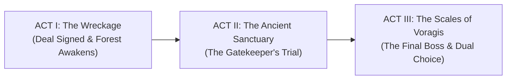

# Story Bible — Guardian Runner: The Unpaid Debt

> **The 3-Second Hook:**  
> *"Her hand slipped. You let her fall. Death didn't take her soul—a debt collector did. Borrow his dark power to climb down and tear her back. But every time you transform, you burn away the man she loved."*

---

## 1. The Core Game Loop & Ludonarrative Hook

In **Guardian Runner**, story and gameplay are the exact same machine:

```
[Guilt of Failure] ──> [Take the Curse] ──> [Unstoppable Power (High Speed/Slashes)]
                                │
                                └──> [Cost: Humanity Drains / Memories Fade]
                                          │
                   ┌──────────────────────┴──────────────────────┐
                   ▼                                             ▼
           Ending A: PURIFIED                            Ending B: ASCENSION
   (Pay the debt, lose the power,                (Keep the godhood, free her soul,
    wake human by her side)                       become the next nightmare in the woods)
```

- **Speed is Survival:** You run because if you stop, the debt collects immediately.
- **Power is Poison:** Transforming into the Shadow Demon lets you vaporize obstacles, but your humanity meter drains. High corruption twists the music, makes the screen tremble, and alters NPC reactions from hope to pure terror.

---

## 2. The Premise & The Accident

### The Cast at the Center
- **The Protagonist: Kaelen.** A guardian knight whose pride was his unbreakable sword and his promise to keep his sister safe.
- **The Lost One: Elysia.** Kaelen's younger sister. An herbalist whose laughter kept him grounded in a brutal world.
- **The Accident (The Whispering Chasm):** While escorting Elysia across an ancient stone bridge, a sudden earth tremor split the arches. Kaelen lunged, catching her fingertips. His gauntlet slipped on the wet stone. She fell into the mist.
- **The Divine Blindspot:** The gods of the Accord divided death into tidy departments—sickness, murder, old age. But a death caused by an *honest rescue attempt that failed* was never claimed by any god. That loophole opened the vault for **Voragis**.

---

## 3. The Cosmology & The Debt Economy

### Voragis — The Broker of Unfinished Grief
Voragis is not a cackling demon; he is an impeccably polite cosmic loanshark. He governs unpaid debts, broken vows, and lingering regret.
- He offers Kaelen a fragment of his own primordial shadow—an advance on power.
- **His Profit:** Whether Kaelen wins or loses, Voragis wins. If Kaelen dies, Voragis claims his soul. If Kaelen succeeds and pays him back, Voragis takes the collected interest (thousands of harvested souls). If Kaelen succumbs, Voragis gains a terrifying new general.

### Candora — The Quiet Defiance
Goddess of Undying Devotion. Deaths born of love should have been hers, but Voragis beat her to the contract.
- She works through the **Moonstone Keeper** and **The Masked Man**, leaving hidden shrines and purification draughts along the runner's path.
- Her aid is real, but it is also a quiet rebellion against Voragis's monopoly.

### Husks vs. Staff: Why You Slay the Forest Undead
- **The Skeletons, Bats, and Blood Zombies are NOT random monsters:** They are previous desperate souls who took Voragis's deal centuries ago and failed.
- Once they collapsed, Voragis extracted their souls. What walks the woods are empty shells—**discarded soda cans**.
- Slaying them doesn't anger Voragis—it amuses him. You're simply taking out his trash while proving your combat worth.
- **Dark Ronin and The Wizard:** They are the rare few who succeeded, but chose power over redemption. They are Voragis's **promoted staff**.

---

## 4. The 3-Act Journey & Pacing Structure



### Act I: The Wreckage & The Deep Forest
- **Setting:** Dark, mossy woods lit by ghostly fireflies and crumbling stone ruins.
- **Inciting Incident:** Kaelen meets **The Ledger** (Voragis's primary collector) at the cliff edge. The pact is sealed.
- **Internal Conflict:** Kaelen feels the icy demon fragment burning in his chest. Every kill feels exhilarating; every whisper reminds him he dropped his sister.
- **Gameplay Hook:** Learning basic dashes, parries, and the adrenaline surge of the first demon burst.
- **Cliffhanger I:** The trees twist shut. The sky turns crimson. A towering shadow blocks the path—the Gatekeeper awakens.

### Act II: The Weeping Canopy & The Sanctuary
- **Setting:** Dilapidated shrines choked by glowing flora; roots clutching forgotten statues of Candora.
- **Midpoint Twist (The Red Herring):** Kaelen believes the **Gatekeeper** is a monstrous demon guarding Elysia's prison. In reality, the Gatekeeper is an ancient neutral arbiter testing whether Kaelen has any human soul left, or if he is already a feral husk.
- **Secondary Characters:**
  - **The Moonstone Keeper:** Warns Kaelen that using the demon blade burns out Elysia's face in his memory. *"Win the race, boy, and you won't even remember whose hand you came to take."*
  - **The Masked Man:** A silent, cloaked runner who matches your speed and throws defensive relics before vanishing into the trees.
- **Boss Encounter:** Defeating the Gatekeeper unlocks the sacred ascent to the celestial realm.

### Act III: The Scales of Voragis
- **Setting:** Crystalline void floating over an abyss of glowing chains.
- **Climax:** Duel with **The Wizard (Herald of the Accord)** and the phantom reflection of **Dark Ronin**.
- **The Final Cliffhanger / The Choice:** Elysia’s crystalline stasis cocoon hangs suspended between Voragis's golden scales and Candora's silver altar.

---

## 5. The Two Endings

Neither choice is simple. Both demand a real sacrifice.

### Ending A: The Human Price (Purified)
> **The Choice:** Kaelen tears the shadow fragment from his own chest and hurls it back onto the scales, forfeiting all godlike powers forever.
>
> **The Outcome:** The dark forest dissolves into morning sunlight. Kaelen falls to his knees, battered, mortal, and exhausted. Across the mossy bridge, Elysia breathes again and opens her eyes. She runs to him. He cannot jump across chasms anymore; he cannot shatter boulders with a thought. But his hands are his own, and when she embraces him, he remembers her name.

### Ending B: The Sovereign Harvest (Ascension)
> **The Choice:** Kaelen embraces the void entirely, letting the demon fragment consume his mortal heart to shatter Voragis's contract by sheer force.
>
> **The Outcome:** Elysia is freed, safe from death forever. But as she opens her eyes and looks up, she does not see her brother. She sees a towering, horned sovereign enveloped in midnight flames. She recoils in terror. Kaelen takes his place upon the obsidian throne, watching over the woods—the new eternal broker of the lost.

---

## 6. In-Game Dialogue & Micro-Barks (Zero Fluff, 100% Impact)

Dialogue in a runner must never stall the player's momentum. Every line is concise, rhythmic, and loaded with subtext and power plays.

### World Encounter Barks

**The Ledger (At the Abyss - Start of Game):**
> *"You dropped her. I caught her. Want her back? Sign here with your pulse."*

**The Moonstone Keeper (Distance 10,500):**
> *"The black flame cuts deep, runner. But look inside: do you still remember the color of her eyes?"*

**The Scythe Spirit / Evil Eye (Distance 7,000):**
> *"Crunch the bones, soldier! Voragis loves the sound of his old debts breaking under your boots!"*

**The Gatekeeper (Boss Intro - Distance 12,500):**
> *"None pass whose hearts have turned to rot. Draw steel, debtor—prove you are still a man."*

**The Wizard (Voragis's Herald - Distance 34,500):**
> *"He thinks love pays debts! Every slash you made in these woods was registered in ink. Now pay the bill."*

---

## 7. Psychological Pacing & Dopamine Hooks

1. **Audio Pulses:** Heartbeat rhythms kick in whenever the player runs low on health or uses the demon transform.
2. **Visual Contrast:** High-saturation bright pixel effects against moody, brooding slate backgrounds make every hit feel impactful.
3. **Escalating Danger:** The forest visibly rots as you run—starting in twilight green and shifting to abyssal crimson as you approach the cosmic court.
4. **Instant Narrative Payoff:** Boss defeats trigger instant cinematic slow-motion slashes, rewarding player reflexes with immediate story advancement.
