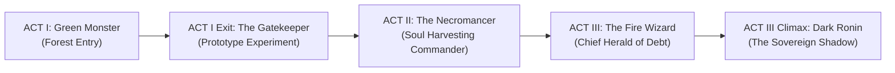

# Story Bible — Guardian Runner: The Unpaid Debt

> **The 3-Second Hook:**  
> *"Her hand slipped. You let her fall. Death didn't take her soul—a debt collector did. Borrow his dark power to climb down and tear her back. But every time you transform, you burn away the man she loved."*

---

## 1. The Core Game Loop & Ludonarrative Hook

In **Guardian Runner**, story and gameplay are the exact same machine:

```
[Guilt of Failure] ──> [Take the Curse] ──> [Unstoppable Power (High Speed/Slashes)]
                                │
                                └──> [Cost: Humanity Drains / Memories Fade]
                                          │
                   ┌──────────────────────┴──────────────────────┐
                   ▼                                             ▼
           Ending A: PURIFIED                            Ending B: ASCENSION
   (Pay the debt, lose the power,                (Keep the godhood, free her soul,
    wake human by her side)                       become the next nightmare in the woods)
```

- **Speed is Survival:** You run because if you stop, the debt collects immediately.
- **Power is Poison (Ludonarrative Tradeoff):** Transforming into the Shadow Demon lets you vaporize obstacles, but burns away your humanity:
  - **Mechanical Risk/Reward:** High corruption grants **+50% dash distance & attack damage**, but narrows your field of vision with a encroaching shadow vignette and makes character control response slightly wild/unstable.

---

## 2. The Premise & The Accident

### The Cast at the Center
- **The Protagonist: Kaelen.** A guardian knight whose pride was his unbreakable sword and his promise to keep his sister safe.
- **The Lost One: Elysia.** Kaelen's younger sister. An herbalist whose laughter kept him grounded in a brutal world.
- **The Accident (The Whispering Chasm):** While escorting Elysia across an ancient stone bridge, a sudden earth tremor split the arches. Kaelen lunged, catching her fingertips. His gauntlet slipped on the wet stone. She fell into the mist.
- **The Divine Blindspot:** The gods of the Accord divided death into tidy departments—sickness, murder, old age. But a death caused by an *honest rescue attempt that failed* was never claimed by any god. That loophole opened the vault for **Voragis**.

---

## 3. The Cosmology & The Debt Economy

### Voragis — The Broker of Unfinished Grief
Voragis is not a cackling demon; he is an impeccably polite cosmic loanshark. He governs unpaid debts, broken vows, and lingering regret.
- He offers Kaelen a fragment of his own primordial shadow—an advance on power.
- **His Profit:** Whether Kaelen wins or loses, Voragis wins. If Kaelen dies, Voragis claims his soul. If Kaelen succeeds and pays him back, Voragis takes the collected interest (thousands of harvested souls). If Kaelen succumbs, Voragis gains a terrifying new general.

### The Dual Whisperers: The Angel and Devil Dynamic
Kaelen's journey is a continuous tug-of-war between two active agents of opposing deities:

* 👿 **The Evil Eye (Voragis's Voice — The Devil on the Left Shoulder):**
  * Associated with **Voragis's Inkwell**.
  * Represents **Darkness & Temptation**. The Eye constantly whispers to Kaelen mid-run: *"Slash deeper! Unleash the demon power! Her soul is slipping!"*
  * Goal: Push Kaelen to abuse the shadow transform so his humanity burns away completely.

* 🌙 **The Moon Knight / Moonstone Keeper (Candora's Voice — The Angel on the Right Shoulder):**
  * Associated with **Candora's Tear**.
  * Represents **Light & Devotion**. The Moon Knight leaves quiet purity shrines and whispers warnings: *"Hold onto her name! Don't let the shadow take your eyes! Every transform burns a memory."*
  * Goal: Keep Kaelen grounded so he can break Voragis's contract without losing his soul.

---

### Husks vs. Enforcers: The Villain Hierarchy
- **The Skeletons, Bats, and Blood Zombies:** Discarded husks of previous failed debtors.
- **Green Monster (Act I Entry):** Wild forest terror blocking the path into the deep woods.
- **The Gatekeeper (Act I Exit / Act II Entry):** Voragis's prototype experiment—a grotesque mixture of debtor souls and shadow power.
- **The Necromancer (Act II Midpoint):** Voragis's soul-harvesting commander. Positioned between Green Monster and The Wizard, the Necromancer re-animates failed debtors to harvest their residual energy for Voragis's ledger.
- **The Fire Wizard (Act III Entrance):** Chief Herald of Voragis—the legal enforcer calculating Kaelen's debt bill.
- **Dark Ronin (Act III Climax):** Voragis's promoted senior sovereign—a former runner who surrendered his humanity completely.

---

## 4. The 5-Boss Journey & Act Pacing Structure



### Act I: The Wreckage & The Deep Forest
- **Setting:** Dark, mossy woods lit by ghostly fireflies and crumbling stone ruins.
- **Inciting Incident:** Kaelen meets **The Ledger** at the cliff edge. The pact is sealed.
- **Boss Encounter 1:** **Green Monster** (Vanguard of the deep woods).
- **Boss Encounter 2:** **The Gatekeeper** (Voragis's prototype experiment guarding the ascent).

### Act II: The Weeping Canopy & The Sanctuary
- **Setting:** Dilapidated shrines choked by glowing flora; roots clutching forgotten statues of Candora.
- **The Dual Whisperer Tension:** The **Evil Eye** urges Kaelen to transform constantly, while **The Moon Knight** provides light sanctuaries.
- **Boss Encounter 3:** **The Necromancer** (Commander of the forest undead, harvesting residual soul interest for Voragis).

### Act III: The Scales of Voragis & The Climax
- **Setting:** Crystalline void floating over an abyss of glowing chains.
- **Boss Encounter 4:** **The Fire Wizard** (Herald of Voragis enforcing the contract bill).
- **Final Boss (Boss Encounter 5):** **Dark Ronin** (The ultimate shadow sovereign).
- **The Final Choice:** Elysia’s stasis cocoon hangs between Voragis's golden scales and Candora's silver altar.

---

## 5. The Two Endings

Neither choice is simple. Both demand a real sacrifice.

### Ending A: The Human Price (Purified)
> **The Choice:** Kaelen tears the shadow fragment from his own chest and hurls it back onto the scales, forfeiting all godlike powers forever.
>
> **The Outcome:** The dark forest dissolves into morning sunlight. Kaelen falls to his knees, battered, mortal, and exhausted. Across the mossy bridge, Elysia breathes again and opens her eyes. She runs to him. He cannot jump across chasms anymore; he cannot shatter boulders with a thought. But his hands are his own, and when she embraces him, he remembers her name.

### Ending B: The Sovereign Harvest (Ascension)
> **The Choice:** Kaelen embraces the void entirely, letting the demon fragment consume his mortal heart to shatter Voragis's contract by sheer force.
>
> **The Outcome:** Elysia is freed, safe from death forever. But as she opens her eyes and looks up, she does not see her brother. She sees a towering, horned sovereign enveloped in midnight flames. She recoils in terror. Kaelen takes his place upon the obsidian throne, watching over the woods—the new eternal broker of the lost.

---

## 6. Fragmented Storytelling & In-Game Delivery

Story is discovered through plain-spoken memory flashbacks when touching relics, while mid-run dialogue barks act as the Angel vs. Devil whisperers.

### Cryptic & Dynamic Micro-Barks (Angel vs. Devil)

**The Evil Eye (Voragis's Devil Whisperer - During High Speed / Kills):**
> *"Slash deeper, soldier! Use the shadow! Every second you hesitate, her soul slips lower!"*

**The Moon Knight (Candora's Angel Whisperer - At Shrines / High Corruption):**
> *"Hold onto her name, Kaelen! Every time you summon the flame, her face fades in your mind."*

**The Ledger (At the Abyss - Start of Game):**
> *"Your fingers were wet. My ink is dry. Run, debtor."*

**The Gatekeeper (Boss Intro):**
> *"Behold the debt's final form! Look upon what you are destined to become!"*

**The Necromancer (Act II Boss Intro):**
> *"Every skeleton you crush goes back into Voragis's ledger! You're just harvesting for us!"*

---

### Flashback Relics (Grounded, Plain-Spoken Memories)

| Relic | Flashback Memory Line (Direct & Grounded) | In-Game Lore Purpose |
| :--- | :--- | :--- |
| **Shattered Gauntlet** | *"Your hand was covered in rain and stone dust. You held her fingers for half a second. Then your glove slipped."* | **The Accident**: Explains the exact moment Kaelen dropped Elysia at the bridge. |
| **Herbalist's Satchel** | *"Elysia carried this pouch everywhere to collect mountain herbs. She promised she’d be back before sunset."* | **The Sister**: Plain human memory of Elysia before the fall. |
| **Voragis's Inkwell** | *"The debt collector didn't ask for gold. He asked if you'd give up your soul to drag her out. The Evil Eye laughed as you signed."* | **The Devil's Ink**: Links Voragis's contract to the Evil Eye's temptation. |
| **Hollowed Ledger Page** | *"A list of everyone who made this deal before you. Every single one failed and turned into the skeletons roaming these woods."* | **The Undead**: Explains why skeletons walk the forest. |
| **Candora's Tear** | *"A warm stone left at a ruined altar. A quiet reminder from the Moon Knight that someone is rooting for you to stay human."* | **The Angel's Light**: Connects Candora's aid to the Moon Knight. |
| **Amalgam Core** | *"This monster was Voragis's prototype—a horrible mix of human souls and shadow power. It's what you will turn into if you lose control."* | **The Gatekeeper**: Explains the boss as Voragis's experiment. |

---

## 7. Psychological Pacing & Dopamine Hooks

1. **Audio Pulses:** Heartbeat rhythms kick in whenever the player runs low on health or uses the demon transform.
2. **Visual Contrast:** High-saturation bright pixel effects against moody, brooding slate backgrounds make every hit feel impactful.
3. **Escalating Danger:** The forest visibly rots as you run—starting in twilight green and shifting to abyssal crimson as you approach the cosmic court.
4. **Instant Narrative Payoff:** Boss defeats trigger instant cinematic slow-motion slashes, rewarding player reflexes with immediate story advancement.

---

## 8. Developer Voice & Public Devlog Strategy

To build authentic trust with the community, devlogs avoid marketing speak and hype language:
- **Raw Behind-the-Scenes Build Logs:** Focus on honest iteration—showing before-and-after clips of gameplay features, broken physics glitches, and collision bugs.
- **Craft Retrospectives:** Share candid breakdowns of what failed during playtesting, why a mechanic was scrapped or reworked, and how technical systems (like collision math or vignette shaders) were built.
- **Plain-Spoken Narrative Notes:** Present lore development as a design tool that serves the player experience, not a marketing gimmick.
